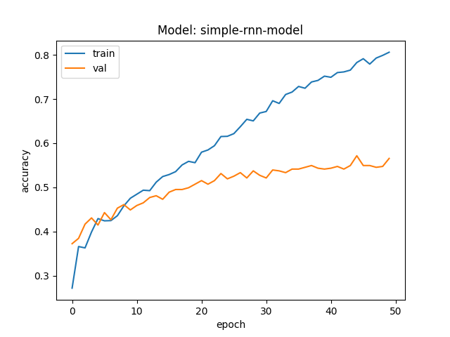

# Q1. Summary

1. Describe the project titled: "Human facial expression detector using Deep Learning Network"
2. Application of Convolutional Neural Network to classify 7 different emotions on FER-2013 dataset, and included performance analysis.
3. Adding batch normalization after each layer and performance analysis.
4. Added dropout so that the model generalizes better.
5. Callback for earlystopping is beneficial, since it allows us to experiment faster.
6. Use data augmentation, to make the model more robust for changes in images
7. Final best model found after hyper parameter tuning, that performed best.
8. Used the trained model for prediction on my facial expressions and converted those expressions to emojis.
9. Plot feature maps of each layer of CNN and analyse the maps.
10. System challenges faced during the model training and mitigated it with different approaches.
11. Accessed a new dataset for machine translation task and explored various NLP techniques.
12. Perform machine translation using Simple RNN and analyse results.
13. Perform machine translation using GRU using embeddings as input and without embeddings as input and compare results.
14. Perform machine translation using LSTM and analyse results.
15. Conclusions on trying different variations of RNNs on machine translation task.

# Q2. Dataset Description

## Dataset 1 Description

I have used [FER-2013](https://www.kaggle.com/msambare/fer2013/download) dataset from Kaggle. The dataset comprises of facial images, with emphasis on the importance of emotions. All the images have single face in the frame and each image is **48x48** pixel grayscale color scheme. The face is more or less centered and occupies about the same amount of space in each image. There are **7** different emotions category shown in the facial expression of the person. The 7 categories are numbered from **0 to 6** both included and can be mapped to the expression as follows: **(0=Angry, 1=Disgust, 2=Fear, 3=Happy, 4=Sad, 5=Surprise, 6=Neutral)**

The dataset occupies about 60Mb of diskspace. It's divided into 2 seperate folders, **train and test**. The train folder corresponds to the training set with **28,709** images and test folder corresponds to the test set with **3,589** images. Each of these folders are sub divided into the 7 different sub directories for 7 different emotions. 

The following table shows the number of images in each category for training and testing:

|       | angry | disgust | fear | happy | neutral |  sad | surprise |
| :---- | ----: | ------: | ---: | ----: | ------: | ---: | -------: |
| train |  3995 |     436 | 4097 |  7215 |    4965 | 4830 |     3171 |
| test  |   958 |     111 | 1024 |  1774 |    1233 | 1247 |      831 |

We notice that the images are not equally distributed, this is an imbalanced dataset. This can be further emphasized by the number of images in train and test bar plot shown below:


We notice that the **disgust** emotion category has least number of images for training and testing and **happy** category has the most number of images. This figure shows that, the number of images in each category are not equal, however, the distribution of number of images in category across the train and test dataset are almost similar.

The following figure gives an idea of how the images look in 7 different categories:


Clearly from this sample set of images displayed, we can tell that:

1. the face of a person is roughly always centered
2. the frame should only contain the face of the person
3. the images are grayscale
4. the facial expression of a person matches the emotion description on that image

## AUC Values

This dataset has images, and plotting AUC for all the pixels as features does not make sense. Hence, rescaled the images to 3x3 images so that each pixel corresponds to a feature. We get 9 features, and calculating the AUC on those, we get the following results. Used only 2 classes of images i.e. the angry and surprise class. Since its a multiclass classification, and having large number of images, using just 2 classes makes sense. Angry class is named 0 and Surprise is named 1.

| Feature       |   AUC |
| :------------ | ----: |
| middle_center | 0.698 |
| bottom_left   | 0.652 |
| bottom_right  | 0.645 |
| middle_left   | 0.641 |
| bottom_center | 0.636 |
| top_center    | 0.622 |
| middle_right  | 0.618 |
| top_left      | 0.581 |
| top_right     | 0.563 |

Every pixel is given a name which is self explanatory. The middle_center has the highest AUC score, which shows that the middle pixel i.e. 2,2 pixel gives more information in our classification task. These AUC scores can be converted to a image, and shown below:


We can see "hot" regions of the image that are most predictive, "cold" regions that are most negatively predictive, and neutral / non-predictive regions (which show up as red, blue, and white, respectively). Since all of our images are just the face cropped and centered, and the important features of expressions (angry and surprise) are usually at the center of image like mouth open feature for surprise, this makes sense that these center pixels have high AUC.

## Dataset 2 Description

For the machine translation task, I picked the Tab-delimited Bilingual Sentence Pairs dataset from [ManyThings.org](http://www.manythings.org/anki/). In this project I'm translating english sentences to a Indian regional language called Kannada, which is spoken in my home town. The dataset is Kannada - English [kan-eng.zip](http://www.manythings.org/anki/kan-eng.zip).

Some initial statistics from my exploratory data analysis. The dataset is 787Mb in size, with 2 seperate files, one for english sentences(train.en) and other for kannada(train.kn). Each line in train.en corresponds to its kannada translation in train.kn. 

```
Total number of english sentences: 4014931
Total number of kannada sentences: 4014931
```

Its a large dataset with roughly 4 Million sentences. Hence, for this project, I prepared a subset of this dataset with sentence words length equal to 5 words without any special charecters and punctuations. \<start\> and \<end\> tokens are used to specify the delimits. Another filtering is sentences with all words belonging to a tiny kannada vocabulary(which I created using word counts) are selected. With these filters, I get a dataset with following statistics:

```
Number of english sentences: 379
Number of kannada sentences: 379
Max English sentence length: 7
Max Kannada sentence length: 7
English vocabulary size: 513
Kannada vocabulary size: 344
```

The large dataset on its own, is too large to use in my project, also the large dataset requires huge amount of data cleaning. Hence, this preprocessed dataset is used for all the analysis. Compared to vocabulary size, there are very few sentences, but it does not load my system and the models give sufficient results.

# Q3. Details

1. Facial expressions(emotions) are an important factor how humans communicate with each other. Humans can interpret facial expressions naturally, however, computers struggle to do the same. This project focuses on classification i.e., detection of human emotions from the images with facial expressions features using deep learning technique called Convolutional Neural Networks.
   
2. In deep learning, a convolutional neural network (CNN, or ConvNet) is a class of artificial neural network, most commonly applied to analyze images. It is a powerful technique, as demonstrated in earlier assignments. CNN preserves the spatial features, which gives it an advantage over other methods like KNN, SVM etc. For this reason I used simple CNN with 2 convolutional layers with 3 by 3 kernel size, followed by max pooling, then 2 dense layers with final dense layer has softmax as activation function so that we can predict the classes. The training/validation accuracy/loss are shown below. I get a peak train accuracy of 0.63 and peak test accuracy of 0.59. Similarly noticed the loss decreasing as we train for more epochs. This shows that the model learns in every epoch i.e., it updates its weights during backpropagation and improves its performance.
   
   

    Here I've noticed the choice of loss function also plays an important role in model training. I've used categorical_crossentropy, which is ideal for multi class classification. Correct loss function has to be chosen based on the dataset and usecase. Used Adam(short for Adaptive Moment Estimation) optimizer which is an update to RMSProp optimizer[4]. With optimizer, there is a hyper parameter called learning rate. This decides the rate at which the weights get updated. It should be small, so that while learning, the model does not skip the minima. The trade-off is that the smaller the learning rate, the longer the model takes to converge. I noticed this while experimenting and tuned this param accordingly. Usually learning rate of 0.001 to 0.0001 gave me good results. High Learning rate like 0.8 etc never converged, the loss was close to 2 in my case.

3. Added batch normalization after each layer. The accuracy did not change much as shown in figure below. There is a sudden drop in accuracy at epoch 4, which could be caused by random selection of images for validation, and most of the images might have belonged to "disgust" category which has very few images in training set.

    

    Learned during assignment 4, that batch normalization plays an important to reduce internal covariate shift (https://arxiv.org/abs/1502.03167). When the output of the previous layer was given as input to the next layer, it gets normalized before propagated through to the next layer and hence the numbers will not grow uncontrollably in the network, thereby giving improvement in our performance. Another advantage of batch norm is it gives our network a resistance to vanishing gradient during training [5]. I get a peak train accuracy of 0.62 and peak test accuracy of 0.57. Here the accuracy did not improve much, however, batch norm is required for a good model training. Future experiments show increase in performance.

4. Added dropout layers after each layers. Since it is a hyperparameter, the rate of dropout is adjusted by tuning. Dropout is used to prevent large neural network models from overfitting, it has been widely used as an efficient regularization technique in practice[6]. This regularization is important, so that the model generalizes well, i.e., it does not over-fit the training data.
   
   

    Here we notice that the accuracy has a huge drop, this is because I dropped many nodes in the network. In future experiments, I've tuned this parameter to get better results.

5. Used an interesting feature of Keras, a callback EarlyStopping. This is passed to the model.fit, it monitors the loss, and stops the training process if the model loss does not improve. This is specially important during experimentation, so that we don't waste our time waiting for a model to complete all the epochs that we mentioned before stopping. In my case, this stopped the training many times when loss did not improve. I set the patience=3, which waits for 3 epochs for loss to improve.

    I also used few other callback functions like, ModelCheckpoint, CSVLogger, ReduceLROnPlateau. ModelCheckpoint was used to save the model checkpoints after epochs so that, if training crashes we can load from the saved weights. I've used the save model weights from here to do the predictions later. CSVLogger is only used to log the various statistics after each metric in an csv file.

    ReduceLROnPlateau is another helpful function which reduces the learning rate, in our case the learning rate of Adam optimizer when the model has stopped improving. When model trains, with a permanent large learning rate, the model's performance will bounce around the minimum most likely always overshooting it. So reducing it can help the model reach better minimum, however this is also a hyperparameter, since the plateau parameters  had to be tuned. 

6. [Data augmentation](https://en.wikipedia.org/wiki/Data_augmentation#:~:text=Data%20augmentation%20in%20data%20analysis,training%20a%20machine%20learning%20model.) is used to increase the amount of data or add variation to the data by adding slightly modified copies of already existing data. We came to know while learning UNET that data augmentation can be used to increase the number of training data, and also these augmentations can make the trained model more robust to changes in real world data. So I used 2 augmentations i.e., zoom and horizontal flip of images using ImageDataGenerator from Keras.

7. After many experimentations and hyper parameter tuning, found a model with 4 convolutional layers perform the best. It has all the features mentioned above and the model layers are shown in the figure below.

    

    The training/validation accuracy/loss are shown below.

    

    The model train accuracy was 0.73 and test accuracy was 0.63 when ran the model on respective datasets after training phase using model.evaluate. This is not as good as an accuracy I got in assignments, its lower than that, thats because this is a difficult multiclass classification problem with images. Recognizing the facial expressions is hard task. The best model accuracy on FER2013 dataset was 0.76 by a model Ensemble ResMaskingNet with 6 other CNNs as stated by paperswithcode.com[87]

    My model performed well after many modification because, I found the best number of convolutional layers, for generalizing I've used dropout layers and batch normalization as well and used hyper parameter tuning to find the best parameters for each. 

8. Model is not useful if it doesn't perform on real world tasks. So I took images of my face using webcam with different expressions and ran model prediction on those images. The model weights were saved in the previous steps, so I did not train my model again, whereas used the same weights and predicted my facial expression. Mapped this expression to an emoji, and displayed the results. The results are shown below.

    

    Initally the model performed very poorly since the images where not cropped to include only the face, cropping is necessary since the model is trained with images that have only face in them. After cropping images, got these results, among the 6 images shown, there was 1 incorrect prediction. The incorrect prediction was on expression disgust, this category has least number of images in our training, that could be the reason it did not classify correctly. However, knowing how to use the model for a real world application is highly beneficial.

9. The feature maps when model is run on 1 image in inference stage is shown below:

    

    Here first 16 features in each layers except dense layers are shown. We see that first layer captures all high level features, some feature maps retain the entire image. As we look further down at 5th row, the feature map looks more like a camera film. The lower we traverse, we get to see lower level features of the image being picked by the model. We can observe that after drop out layer, some of the feature maps are completely blank. When we look at last layer here, very low level features like some dashes and rectangles are captured.


10. Model training was performed on GPU, Nvidia GeForce GTX 1050 Ti with 4 GB of memory. Training was the most intensive task, which when performed, it utilized the full capacity of the system. The main parameter that I used so that the system does not run out of memory was the training batch size. Successfully performed training on various settings with batch size = 32, which was ideal on my system. When we increase the batch size, the number of training images that get loaded into memory for processing increases. Some studies show that large batch sizes don't generalize well [3]. The lack of generalization ability is due to the fact that large-batch methods tend to converge to sharp minimizers of the training function [3]. When batch size = 32, the total training images = 28709 / 32 = 897 minibatches were created. One epoch is complete when training is completed on all these 897 mini batches.

    As suggested by Dr. Levmann, when I was struggling with compute resources to train such a huge model, training was performed on a reduced set of images. This greatly help me to experiment with different architectures faster then used entire dataset on those best model settings. This could have included some bias while selecting the smaller dataset.

11. Performed English to Kannada translation using Tab-delimited Bilingual Sentence Pairs dataset from [ManyThings.org](http://www.manythings.org/anki/). This is the most difficult task I did in this project, since it involves NLP, which was not done during assignments. I started with data preparation as mentioned in "Dataset 2 Description" to get 379 sentences each. I removed all the punctuations as well, so that the model does not need to predict punctuations there by limiting the vocabulary. Furthermore, we cannot use this tiny dataset as is, it has to be converted to tokens. Tokenizing is turning each sentence into a sequence of integers (each integer being the index of a token in a dictionary) which is necessary since models perform better on numerical values than pure strings. Both inputs and targets are tokenized using `Tokenizer` from `tf.keras.preprocessing.text`. So each sentence is converted to tokens, however, they will have different lengths. For our downstream task we have to make all tokens of equal length, hence we pad a token at the end of each token sequence by using `pad_sequences` from `tf.keras.preprocessing.sequence`. Later this padded token can be replaced by `<PAD>` in predicted output to signify that this was a token added for padding. This completes the data preprocessing and data is ready to be consumed by the model.

    Interesting fact about `<PAD>`(padding) is that, when I used, highly imbalanced data, i.e., english sentences was short and one kannada sentence length was extremely large, hence all the sequences where padded to make it equal length and suddenly the validation model accuracy was close to 90%, this is because the model was predicting only `<PAD>` and since the performace metric is just accuracy, the accuracy score was high. However, mitigated this problem, by removing that one outlier sentence which had too many words.

    RNNs can take sequences of input and return sequences of output. CNN is not good for this task, since it does not retain the previous information which is required in machine translation. I used `many to many` RNN setup for this task because we input sequence of tokens and expect the model to translate to sequence of tokens in other language.

    Embeddings are used to train the model instead of pure sequence of tokens because it allows us to capture more precise syntactic and semantic word relationships. This is achieved by projecting each word into n-dimensional space. Words with similar meanings occupy similar regions of this space; the closer two words are, the more similar they are. And often the vectors between words represent useful relationships, such as gender, verb tense, or even geopolitical relationships. There are pretrained embeddings package such as GloVe or word2vec but here i've used `Embedding` layer from keras.

    The performance metric is `accuracy` which is not ideal for this task, as it expects the predicted translated text to be exact match to actual translated text. Languages are extremely robust, such that different words can have same meaning. With the constraint of this accuracy metric in mind, we use it since it is easier to implement. Other metric that could possibly used is BLEU score. The accuracy scores of most of my models are poor, however, we will judge the models based on how the model predicts the translated text on 2 unseen sentences.

12. A simple RNN architecture is created using the following layers: embedding layer with output embedding size of 64, simple_rnn layer with 256 RNN units followed by 2 Dense layers with final Dense layer has 'softmax' activation for prediction. Dropout layer was added so that the model generalizes well. Model had 730,776 trainable parameters.

    

    Here we notice that the training accuracy keeps on increasing but validation accuracy stagnates after 10th epoch. The model overfits the data after 10th epoch. With such a small dataset, and relatively large vocabulary and the accuracy as performance metric, the low performance can be attributed to the tiny dataset. However, the predicted results are good (Although only 2 test samples are used to predict) as shown below:

    ```
    Ground truth 1:
	en: Economic Development and Social Change
	kn: ಆರ್ಥಿಕ ಅಭಿವೃದ್ಧಿ ಮತ್ತು ಸಾಮಾಜಿಕ ಬದಲಾವಣೆ

    Prediction:
	kn: <start> ಇದು ಮನೆ ಮತ್ತು ಪ್ರಚಾರ ನಿಯಮಗಳು <end>


    Ground truth 2:
	en: in front of her house
	kn: ಅವರು ಮನೆ ಮುಂದೆ

    Prediction:
	kn: <start> ಇದು ಮನೆ ಮುಂದೆ <end> <PAD> <PAD>
    ```

    Prediction analysis:

    Text 1: RNN struggled to predict exact translation, however was able to translate one word correctly.

    Text 2: The translation is almost accurate, the first translated word error can be attributed to the translation difficulty from english to kannada even for humans.

12. GRU is Gated recurrent units which like LSTM are a gating mechanism in recurrent neural networks. Unlike LSTM, GRU has only 2 gates, reset gate and update gate. Reset gate, decides how much past information to forget. Update gate decides what information to discard and what information to add. The model performance with and without embedding layer is quite poor for GRU. Compared to GRU with embedding layer, the GRU without embedding is even worse. This shows that we get performance gain by using embeddings instead of input pure tokens.

      

    ```
    Results with embeddings:

    Ground truth 1:
	en: Economic Development and Social Change
	kn: ಆರ್ಥಿಕ ಅಭಿವೃದ್ಧಿ ಮತ್ತು ಸಾಮಾಜಿಕ ಬದಲಾವಣೆ

    Prediction:
	kn: <start> ಇದು ಮತ್ತು ಮತ್ತು <end> <PAD> <PAD>


    Ground truth 2:
	en: in front of her house
	kn: ಅವರು ಮನೆ ಮುಂದೆ

    Prediction:
	kn: <start> ರಾಹುಲ್ ಮನೆ ಆರೋಗ್ಯ <end> <PAD> <PAD>
    ```

    ```
    Results without embeddings:
    
    Ground truth 1:
	en: Economic Development and Social Change
	kn: ಆರ್ಥಿಕ ಅಭಿವೃದ್ಧಿ ಮತ್ತು ಸಾಮಾಜಿಕ ಬದಲಾವಣೆ

    Prediction:
	kn: <start> ಇದು ವಿರುದ್ಧ <end> <end> <end> <PAD>


    Ground truth 2:
	en: in front of her house
	kn: ಅವರು ಮನೆ ಮುಂದೆ

    Prediction:
	kn: <start> ಜೀವನ ಹೇಗೆ <end> <PAD> <PAD> <PAD>
    ```

    Prediction analysis:

    With Embedding layer: GRU struggled to predict, however was able to translate one word correctly in both texts.

    Without Embedding layer: The translation is useless and does not make sense. Other observation is that, it was **not** able to predict the end token as well, in text1, there are 2 end tokens

13. Long short-term memory (LSTM) is a RNN architecture but with 4 gates, with each performing different task. The vanilla RNN has a problem of vanishing gradients, i.e., during backpropogation as we reach the initial layers the gradient diminishes exponentially and becomes so small such that those initial layers will not get any updates. The RNN essentially have short term memory, hence LSTM was introduced. With its various gates its able to retain relevant information longer.

    Ran the LSTM with 64 units and got the following performance during training. There were 534,232 trainable parameters in this LSTM.

    

    From the figure we notice that the train and validation accuracy start to diverge, showing that training is overfitting. However, there is slight improvement in validation accuracy. Improvement starts getting stagnated about after 80th epoch. The interesting fact comes when we see the results.

    ```
    Ground truth 1:
	en: Economic Development and Social Change
	kn: ಆರ್ಥಿಕ ಅಭಿವೃದ್ಧಿ ಮತ್ತು ಸಾಮಾಜಿಕ ಬದಲಾವಣೆ

    Prediction:
	kn: <start> ಇಬ್ಬರ ಮತ್ತು ಮತ್ತು <end> <end> <PAD>


    Ground truth 2:
	en: in front of her house
	kn: ಅವರು ಮನೆ ಮುಂದೆ

    Prediction:
	kn: <start> ನಿಮ್ಮ ಮನೆ ಮುಂದೆ <end> <PAD> <PAD>
    ```

    Prediction analysis:

    Text 1: The prediction has only 1 correct word and result is similar to Simple RNN.

    Text 2: Here translation is almost accurate, better than the simple RNN.

14. The results are not as good as how google translates, because, the dataset used for these experiments are relatively tiny with larger vocabulary and shorter training period. The reason for not including more sentences and training the model is that, simply randomly including the sentences from the corpus, did not help as the data is not well curated, many things to consider while including sentences such as check vocabulary size does not explode, etc., hence keeping time contraint to submit the model, I settled with this tiny corpus for this translation task. Even with such a tiny set of 379 sentences, the Simple RNN and LSTM was able to learn from this sequential data and translate it, which is the most interesting finding of this project. LSTM was the best performer. With more cleaned data and longer training and possibly more LSTM units this model would perform better. My furture work will include, a newer approach called [Sequence to Sequence Learning with Neural Networks](https://arxiv.org/pdf/1409.3215.pdf) which boasts of performance improvement using encoder-decoder architecture.

## References

1. Course project dataset: https://www.kaggle.com/msambare/fer2013/download
2. Real-time Convolutional Neural Networks for Emotion and Gender Classification https://arxiv.org/pdf/1710.07557.pdf
3. Trade-off between batch size and number of iterations to train a neural network: https://stats.stackexchange.com/a/236393/184082
4. Wiki-Adam: https://en.wikipedia.org/wiki/Stochastic_gradient_descent#Adam
5. Batch Norm: https://www.kdnuggets.com/2018/09/dropout-convolutional-networks.html
6. Dropout: https://arxiv.org/pdf/1904.03392.pdf
7. Benchmark on FER2013: https://paperswithcode.com/sota/facial-expression-recognition-on-fer2013
8. Translation dataset: http://www.manythings.org/anki/kan-eng.zip

## Run instructions

1. Install all required packages.
2. Run `python main.py`
3. Use `config.toml` to configure different run modes. Use `mode="FER-train"` for training the FER model, likewise other modes as defined in `config.toml`.
4. Successfully compiled with `mypy`, `isort` and `flake8`